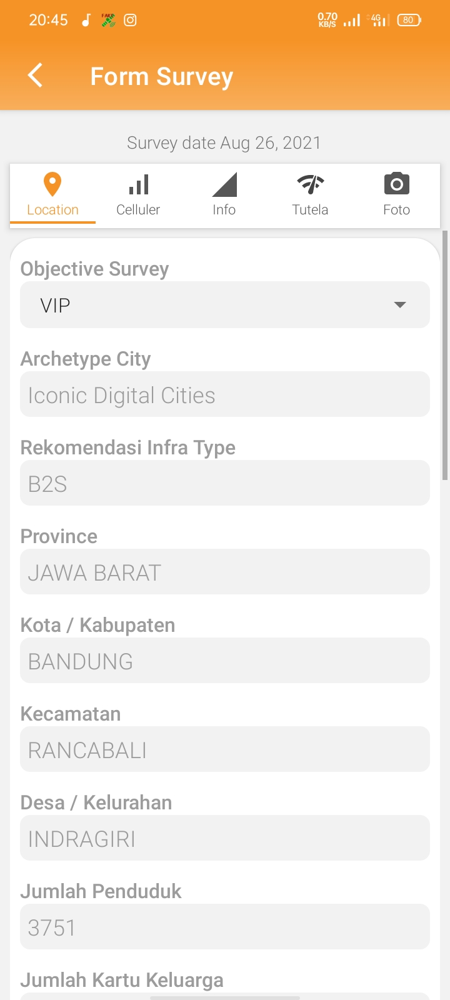

## Usage Application
> Nano (New Infra Analytical Tools) is android application to survey the strenght signal of telkomsel, it based on location which choosen by surveyor. This app also show the comparation with another communication operator including download and upload throughput, latency, and device share.

## Screenshots

  
  
  
  

## Application Features
- Login
- Show warning is surveyor in radius 100m with previous survey
- Autofill real location by latitude and longitude
- Show signal strength operator surveyor
- Manager can get notification about new survey
- Manager can approve and reject survey with taken by staff
- Filter survey by regional survey

## Language & Libraries
- Java (as programming language)
- Android Volley
- Squareup Picasso
- MPAndroidChart